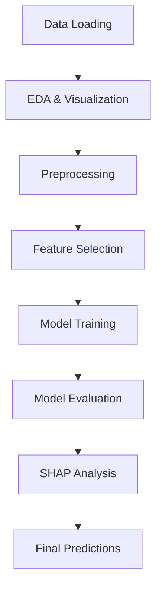

<h1 align="center">🏡 Enhanced House Price Prediction</h1>

<p align="center">
  
  
  
  
</p>

<p>
  A complete end-to-end machine learning pipeline for predicting house prices using powerful ensemble models, advanced preprocessing, and SHAP explainability.
</p>

---

## ✨ Features

- 🔍 In-depth EDA and visualization
- ⚙️ Modular preprocessing pipelines (numerical + categorical)
- 🧠 Feature selection using statistical methods
- 🌲 Random Forest, XGBoost, LightGBM, and more
- 📊 SHAP visualizations for model interpretation
- 📁 Submission-ready predictions

---

## 🧱 Tech Stack

> This project leverages the following tools:

- **Python 3.9+**
- `pandas`, `numpy`, `matplotlib`, `seaborn`
- `scikit-learn`, `xgboost`, `lightgbm`
- `shap`, `scipy`, `statsmodels`

---

## 🧭 Project Flow


---
## 🛠️ Installation
```bash
# 1. Clone the repository
git clone https://github.com/kirtygupta/CSI.git
cd "CSI/House Price Prediction"

# 2. (Optional but recommended) Create and activate a virtual environment
python -m venv venv
source venv/bin/activate      # On Windows: venv\Scripts\activate

# 3. Install dependencies
pip install -r requirements.txt

# 4. Open the Jupyter Notebook
jupyter notebook "House Price Prediction.ipynb"

```
---
## 🧪 Models Used
| Model            | Grid Search Tuning | SHAP Analysis | Final RMSE (CV) |
| ---------------- | ------------------ | ------------- | --------------- |
| 🎯 Random Forest | ✅                  | ✅             | ✅               |
| ⚡ Gradient Boost | ✅                  | ✅             | ✅               |
| 🧨 XGBoost       | ✅                  | ✅             | ✅               |
| 🌟 LightGBM      | ✅                  | ✅             | ✅               |
---
## 💡 SHAP Insights
SHAP values provide model-agnostic interpretation and explain how each feature impacts the model’s output. The project includes:

* SHAP Summary Bar Plot
* SHAP Value Distribution Plot
* Top Features Impact
---
## 🚀 Final Output
* Predictions are transformed back from log scale.

* A CSV file submission.csv is generated with [Id], [SalePrice (predicted)]
---
## 📌 Future Enhancements
* Ensembling and Stacking
* Web dashboard with Streamlit
* Deep learning models (optional)
---

## 🤝 Contribution

Pull requests are welcome! If you’d like to suggest improvements or add new features:

```bash
# Fork the repository and clone it locally

# Create a new branch for your feature
git checkout -b feature/YourFeature

# Make your changes, then commit
git add .
git commit -m "Add YourFeature"

# Push the branch to your fork
git push origin feature/YourFeature

```
#### Then, open a pull request here:  
#### 👉 [Create a Pull Request](https://github.com/kirtygupta/CSI/compare)
---

<h3> 👋 Author: Kirty Gupta</h3>

---

<p align="center"> Built with ❤️ for machine learning enthusiasts. </p> 
